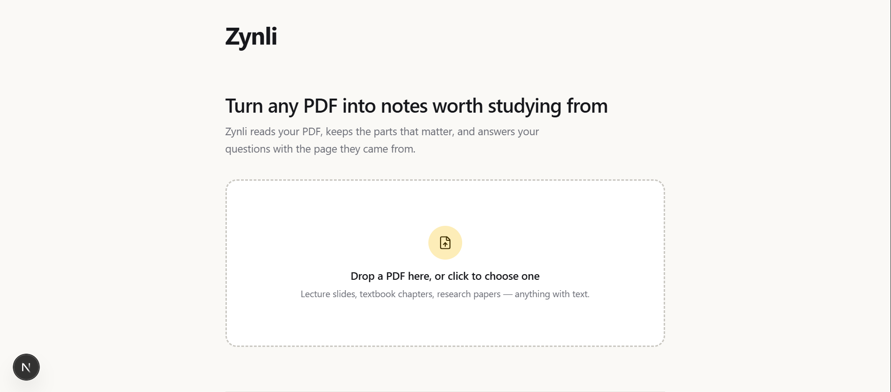

# Zynli

Turn any PDF into notes worth studying from. Upload a PDF and Zynli pulls
out the core concepts, lets you ask it questions with page citations, and
looks up any topic you're stuck on — all backed by a real RAG pipeline.

Built as a portfolio project to learn end-to-end RAG (retrieval-augmented
generation): PDF ingestion, chunking, embeddings, vector search, and LLM
grounding, wired up to an actual product rather than a notebook.



## What it does

- **Digest**  reads a PDF and distills it into clean notes: core concepts
  and definitions, grouped by section, with the filler stripped out.
- **Ask** a chat interface scoped to that PDF. Every answer is retrieved
  from the document itself (RAG) and cites the page number it came from.
- **Topic Search** free-text search for anything, on or off the PDF's
  topic. Pulls live web results and summarizes them with sources.
- **Notes** save any Digest or Topic Search result, then export
  everything as a single Markdown file.

## Stack

| Layer         | Choice                                                        |
|---------------|-----------------------------------------------------------------|
| Frontend      | Next.js (App Router), TypeScript, Tailwind CSS v4                |
| Backend       | FastAPI (Python)                                                  |
| Vector store  | ChromaDB  one collection per uploaded PDF                       |
| Embeddings    | `sentence-transformers` (all-MiniLM-L6-v2), local, free           |
| LLM           | Groq free tier (`openai/gpt-oss-120b`)                            |
| Web search    | DuckDuckGo via `ddgs`, free, no API key                           |


## Project structure

```
backend/ FastAPI app — PDF processing, vector store, LLM calls, API routes
frontend/ Next.js app — upload UI, document workspace, Digest/Ask/Search/Notes tabs
```

Each has its own README with setup details:
- [`backend/README.md`](./backend/README.md)
- [`frontend/README.md`](./frontend/README.md)

## Quick start

**Backend** (needs Python 3.11 or 3.12 — not 3.13+, some dependencies don't
have prebuilt wheels for it yet):

```bash
cd backend
python -m venv venv
venv\Scripts\activate     

pip install -r requirements.txt
uvicorn app.main:app --reload --port 8000
```

**Frontend** (needs Node.js):

```bash
cd frontend
npm install

npm run dev
```

Open `http://localhost:3000`.